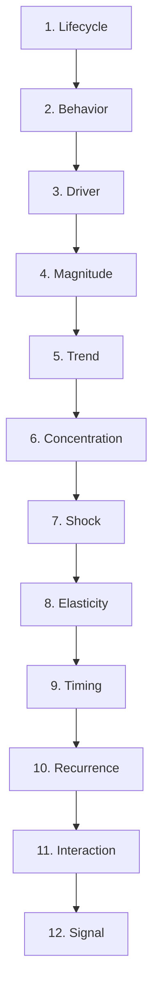

# Demand Pattern Taxonomy
## Standard Reference for Pure Demand Forecasting · v1.0.0

Welcome to the **Demand Pattern Taxonomy** knowledge base. This portal serves as the definitive technical specification for classifying demand signals across 12 dimensions and 65 segments.

---

### 🗺️ Taxonomy Map

---

### 🚀 Quick Access

| Dimension | Key Focus | Segments |
| :--- | :--- | :---: |
| [**01 · Lifecycle**](dimensions/01-lifecycle.md) | Product age and trend status | 7 |
| [**02 · Behavior**](dimensions/02-behavior.md) | CV² and ADI classification | 8 |
| [**03 · Driver**](dimensions/03-driver.md) | Causal factors (Weather, Promo) | 6 |
| [**04 · Magnitude**](dimensions/04-magnitude.md) | Volume-based tiering | 4 |
| [**05 · Trend**](dimensions/05-trend.md) | Growth/Decline trajectories | 5 |
| [**06 · Concentration**](dimensions/06-concentration.md) | Demand density patterns | 5 |
| [**07 · Shock**](dimensions/07-shock.md) | Sensitivity to disruptions | 6 |
| [**08 · Elasticity**](dimensions/08-elasticity.md) | Price and promo sensitivity | 4 |
| [**09 · Timing**](dimensions/09-timing.md) | Lead/Lag trigger patterns | 5 |
| [**10 · Recurrence**](dimensions/10-recurrence.md) | Interval consistency | 5 |
| [**11 · Interaction**](dimensions/11-interaction.md) | Substitution & Halo effects | 5 |
| [**12 · Signal**](dimensions/12-signal.md) | SNR and Bullwhip quality | 5 |

---

### 📐 Formula Central
Need the math? Visit the [**Formula Reference**](formula-reference/01-core-metrics.md) for all quantitative thresholds across Daily, Weekly, Monthly, Quarterly, and Yearly granularities.

---

> [!TIP]
> Use the **Search (Ctrl+K)** to quickly find any of the 65 segments or specific forecasting formulas.
